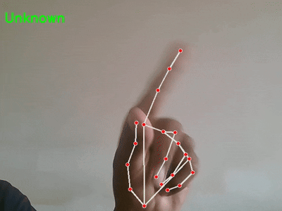

# Real-Time Hand Gesture Recognition

👤 Name: Your Full Name  

## 📌 Objective
A Python application that uses a webcam to recognize static hand gestures in **real-time**.  
Recognized gestures:  
- 🖐️ Open Palm  
- ✊ Fist  
- ✌️ Peace Sign  
- 👍 Thumbs Up  

## 📌 Technology Justification
- **OpenCV** → For real-time webcam integration, video frame handling, and visualization.  
- **MediaPipe Hands** → Provides 21 accurate hand landmarks with lightweight, real-time inference.  
- **NumPy** (optional) → Can be used for vector math and gesture rules.  

👉 Chosen because **MediaPipe** is faster and more reliable than training a CNN from scratch, making it ideal for this rule-based gesture recognition.

## 📌 Gesture Logic
Gesture classification is rule-based:  
- **Open Palm** → All fingers extended  
- **Fist** → All fingers folded  
- **Peace Sign (✌️)** → Index + Middle extended, others folded  
- **Thumbs Up (👍)** → Only thumb extended  

Fingertip positions are compared with their corresponding knuckles to decide whether a finger is “open” or “folded”.

## 📌 Setup Instructions
Clone the repository and install dependencies:
```bash
git clone https://github.com/YOURUSERNAME/hand-gesture-recognition.git
cd hand-gesture-recognition
pip install -r requirements.txt
python app.py

# Demo

Here’s a demo of the gesture control:




<video width="600" controls>
  <source src="demo.mp4" type="video/mp4">
  Your browser does not support the video tag.
</video>
